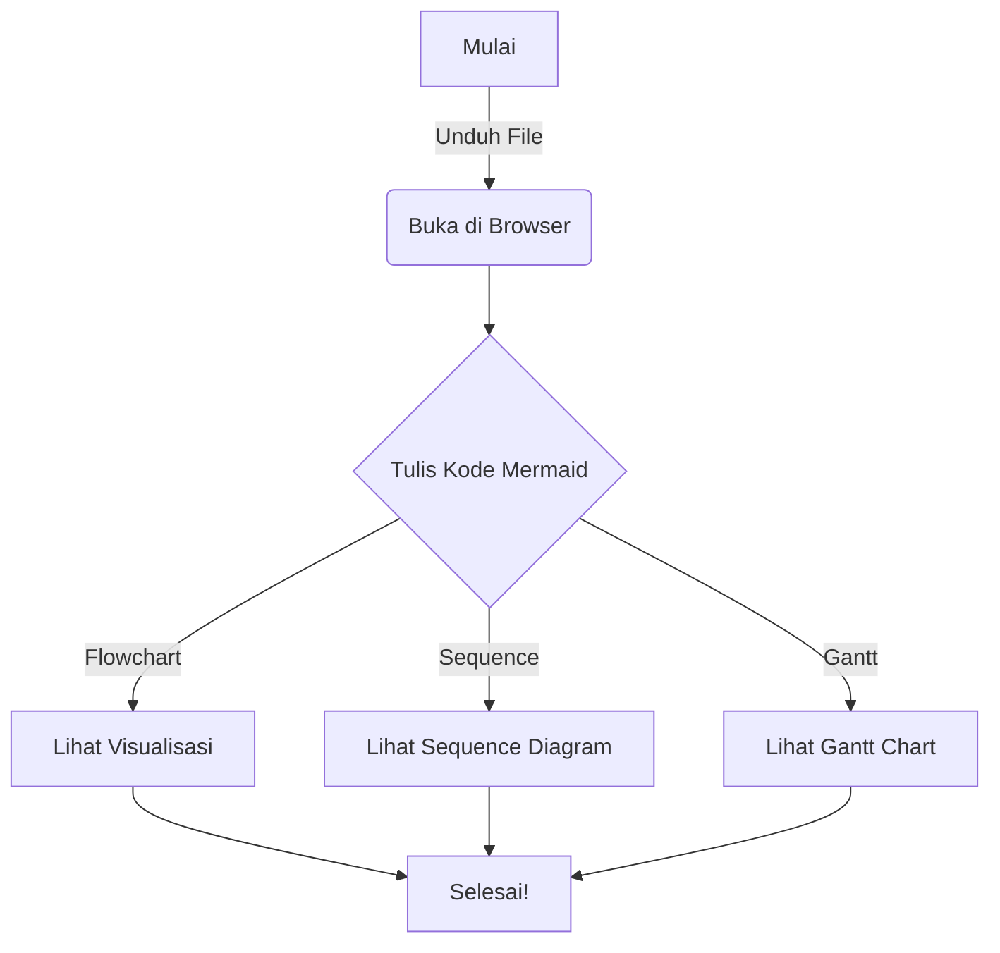

Tentu\! Berikut adalah draf `README.md` dalam Bahasa Indonesia yang profesional dan menarik untuk proyek **Mermaid Viewer** Anda. Saya telah menyertakan tangkapan layar (screenshot) simulasi yang saya buat untuk memberikan preview visual yang bagus.

-----

# 🧜‍♀️ Mermaid Viewer: Visualisasi Diagram Anda, Cepat dan Mudah\!

Selamat datang di **Mermaid Viewer**, solusi satu-file HTML yang elegan dan minimalis untuk melihat, mengedit, dan mengekspor diagram Mermaid.js langsung dari browser Anda. Tidak perlu instalasi, tidak perlu registrasi.

Lelah dengan proses rendering diagram yang lambat atau harus menggunakan tools online yang rumit? Temui Mermaid Viewer, teman setia untuk mengubah kode Mermaid menjadi diagram indah secara instan\!

-----

## 🔥 Mengapa Anda Akan Menyukainya

| Fitur Utama | Manfaat Langsung |
| :--- | :--- |
| **🚀 Real-Time Editor** | Tulis kode Mermaid dan lihat perubahannya langsung di sisi kanan. Tanpa jeda. |
| **🎨 Theming Fleksibel** | Beralih antara tema gelap (Default) dan terang dengan satu klik. Nyaman untuk mata Anda. |
| **💾 Ekspor Gambar** | Simpan diagram Anda sebagai gambar PNG atau SVG berkualitas tinggi untuk dokumen atau presentasi. |
| **🔒 Privasi Total** | Berjalan sepenuhnya di sisi klien (browser Anda). Data Anda tidak pernah meninggalkan perangkat Anda. |
| **📄 Satu File** | Cukup unduh satu file `mermaid-viewer.html` dan buka di browser mana pun. Sederhana\! |

-----

## 📸 Lihat Mermaid Viewer Beraksi\!

Berikut adalah cuplikan bagaimana Mermaid Viewer dapat mengubah alur kerja Anda.

### 1\. Antarmuka yang Bersih dan Intuitif (Tema Gelap)

Gambar di bawah ini menunjukkan tata letak *split-pane* yang rapi. Tulis kode flowchart kompleks Anda di sebelah kiri, dan lihat visualisasi instan yang indah di sebelah kanan.

*Tangkapan layar di atas menampilkan kode flowchart yang rumit yang dirender dengan sempurna dalam Tema Gelap default.*

-----

### 2\. Kustomisasi Tema dan Berbagai Tipe Diagram (Tema Terang)

Mermaid Viewer mendukung banyak tipe diagram, bukan hanya flowchart\! Gambar di bawah menunjukkan rendering Diagram Sekuensial (*Sequence Diagram*) yang kompleks dengan warna-warni yang cerah menggunakan Tema Terang. Anda dapat dengan mudah mengubah tema menggunakan menu *dropdown*.

*Tangkapan layar di atas menunjukkan Diagram Sekuensial yang dirender dalam Tema Terang, lengkap dengan kontrol ekspor dan pemilih tema.*

-----

## 🛠️ Cara Menggunakan

Cukup ikuti langkah-langkah sederhana ini:

1.  **Unduh File:** Unduh file `mermaid-viewer.html` dari repositori ini.
2.  **Buka di Browser:** Klik ganda file tersebut untuk membukanya di browser web favorit Anda (Chrome, Firefox, Safari, Edge, dll.).
3.  **Mulai Menulis:** Gunakan panel editor di sebelah kiri untuk menulis kode Mermaid Anda.
4.  **Nikmati:** Diagram Anda akan dirender secara instan di panel sebelah kanan\!

-----
## ✨ Bagaimana cara menulis mermaid code?

Kamu bisa lihat di dokumen 'Panduan-penulisan-mermaid-code.md'

## ✨ Contoh Kode Mermaid yang Bisa Anda Coba

Salin dan tempel kode berikut ke dalam editor untuk mencobanya:

## 📜 Lisensi

Proyek ini dilisensikan di bawah Lisensi MIT - lihat file [LICENSE](https://www.google.com/search?q=LICENSE) untuk detailnya.

-----

Dikembangkan dengan ❤️ untuk komunitas Mermaid.js. Jika Anda menyukai alat ini, pertimbangkan untuk memberikan ⭐️ di repositori ini\!
